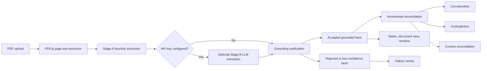

# Fact Knowledge Layer

Fact Knowledge Layer is a client-side React application for turning PDF documents into reviewable, source-backed facts. It extracts values and statements, keeps the page-level evidence for each fact, and compares facts across documents.

The project includes Delhivery logistics documents and India macroeconomy documents as starter data. New PDFs can also be uploaded from the Document Hub.

## Live Demo

[https://fact-ochre.vercel.app/](https://fact-ochre.vercel.app/)

## Demo Video

Add the demo video link here: `[Insert Link Here]`

## Run Locally

Requirements:

- Node.js 18 or newer
- npm 9 or newer

```bash
npm install
npm run dev
```

Open `http://localhost:5173/`.

To run the production build check:

```bash
npm run build
```

## How It Works



The normal path does not require a paid API. Stage A uses deterministic patterns for metrics, percentages, dates, common table layouts, and status statements. An OpenAI or Gemini key can be added for optional semantic extraction from prose.

Before a fact is stored, its quote is checked against the extracted text of the cited page. Facts that cannot be grounded are rejected. Accepted facts retain their document ID, filename, page number, quote, extraction stage, and confidence score.

## Main Views

- **Dashboard**: workspace counts and representative relationships.
- **Document Hub**: upload one or more PDFs and view processing status.
- **Document View**: inspect page text and the facts grounded on that page.
- **Fact Matrix**: search facts and filter relationships across documents.
- **Timeline**: group dated facts by reporting period and inspect changes over time.
- **Showcase**: review corroboration, contradiction, context reconciliation, and handled extraction cases.

## Data Model

A `GroundedFact` contains the extracted entity, attribute, value, normalized value, time period, scope, and an evidence object:

```ts
type GroundedFact = {
  id: string;
  entity: string;
  attribute: string;
  value: string;
  normalizedValue: number | string | boolean;
  timePeriod?: string;
  scope?: string;
  evidence: {
    documentId: string;
    documentName: string;
    pageNumber: number;
    verbatimQuote: string;
    confidenceScore: number;
  };
};
```

Relationships connect two facts when their entity and attribute are similar. The reconciler classifies them as `CORROBORATED`, `CONTRADICTION`, `RECONCILED_BY_CONTEXT`, or `FAILURE_HANDLED`.

## Engineering Decisions And Trade-offs

### Client-side processing

PDF parsing and the default extraction path run in the browser. This keeps the prototype easy to run and avoids sending documents to a server by default. The trade-off is that very large PDFs use the browser's memory and processing time.

### Heuristics before an LLM

The first extraction pass is deterministic and cheap. It is easier to debug and makes the source of a numeric fact clear. The optional LLM pass helps with prose, but it is slower, depends on an API key, and can still produce quotes that fail grounding verification.

### Evidence as a hard check

A fact is not accepted only because an extractor produced it. The quote must match the source page text. This reduces unsupported claims, but it can reject valid facts when a PDF has unusual spacing, broken text order, or scanned pages.

### Incremental reconciliation

When a new PDF is uploaded, its facts are compared with the existing workspace facts. Existing relationships are kept instead of recomputing the whole workspace. This makes repeated uploads faster and preserves the user's review state, but the current prototype does not yet deduplicate every semantically identical fact.

### Rule-based relationship classification

The reconciler uses value, time, scope, unit, and status fields to explain relationships. This keeps decisions auditable. The trade-off is that an ambiguous entity name or an unusual metric label can prevent a match even when a human would recognize the connection.

## Limitations And Next Steps

- Scanned image PDFs need OCR; the current parser depends on embedded PDF text.
- Complex multi-column tables can lose their original reading order during extraction.
- Entity matching is lightweight and would benefit from a proper entity registry.
- Large workspaces would benefit from stronger deduplication and background processing.
- The next extraction improvement would be coordinate-aware table parsing so labels, units, and values stay connected.

## Project Structure

```text
src/
  components/       React views and interaction panels
  data/             starter workspaces and example facts
  lib/
    pdfParser.ts    PDF.js page text extraction
    factExtractor.ts  heuristic and optional LLM extraction
    reconciler.ts   cross-document relationship logic
  types/            shared TypeScript data types
```

## Development Tools

The interface uses React, TypeScript, Vite, Tailwind CSS, Lucide icons, and Framer Motion. PDF text extraction uses PDF.js. Optional semantic extraction supports OpenAI and Gemini when the user supplies a key through the settings panel.
